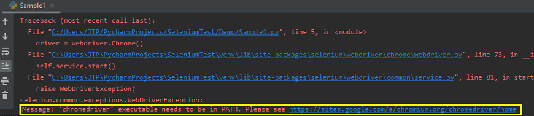

# First create the virtualenv
virtualenv -p python3 env_name
# Activate the created virtualenv 
source env_name/bin/activate
# then install the selenium package
pip install selenium
# install pytest
pip install pytest

# Pre -requisites  to run test scripts
Below exception will raise 
If we don't have chrome driver executable file in our local when we run the test script 

# to resolve the above issue , download the chrome driver executable file use below link
https://chromedriver.storage.googleapis.com/index.html

# unzip  the chromedriver zip file
unzip chromedriver.zip

# to automate the below link
https://www.tutorialspoint.com/selenium/selenium_automation_practice.htm

